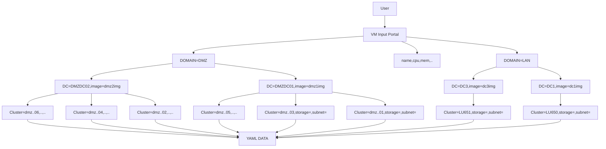

```mermaid
graph TD
   A[User] --> B[VM Input Portal]
   B --> C[DOMAIN=LAN]
   B --> BC[name,cpu,mem,..]
   B --> D[DOMAIN=DMZ]
   C --> E[DC=DC1,image=dc1img]
   C --> F[DC=DC3,image=dc3img]
   D --> G[DC=DMZDC01,image=dmz1img]
   D --> H[DC=DMZDC02,image=dmz2img]
   E --> I[Cluster=LU650,storage=,subnet=]
   F --> J[Cluster=LU651,storage=,subnet=]
   G --> K[Cluster=dmz..01,storage=,subnet=]
   G --> L[Cluster=dmz..03,storage=,subnet=]
   G --> M[Cluster=dmz..05,..,..]
   H --> N[Cluster=dmz..02,..,..]
   H --> O[Cluster=dmz..04,..,..]
   H --> P[Cluster=dmz..06,..,..]
   P --> R[YAML DATA]
   O --> R
   N --> R
   M --> R
   L --> R
   K --> R
   J --> R
   I --> R
```
