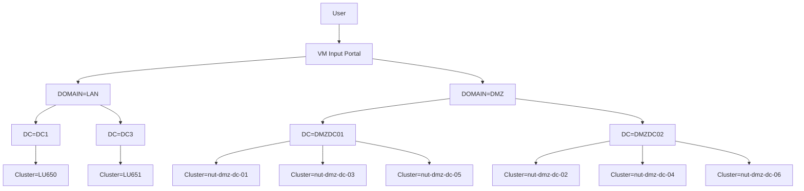

```mermaid
graph TD
   A[User] --> B[VM Input Portal]
   B --> C[DOMAIN=LAN]
   B --> D[DOMAIN=DMZ]
   C --> E[DC=DC1]
   C --> F[DC=DC3]
   D --> G[DC=DMZDC01]
   D --> H[DC=DMZDC02]
   E --> I[Cluster=LU650]
   F --> J[Cluster=LU651]
   G --> K[Cluster=nut-dmz-dc-01]
   G --> L[Cluster=nut-dmz-dc-03]
   G --> M[Cluster=nut-dmz-dc-05]
   H --> N[Cluster=nut-dmz-dc-02]
   H --> O[Cluster=nut-dmz-dc-04]
   H --> P[Cluster=nut-dmz-dc-06]
```
